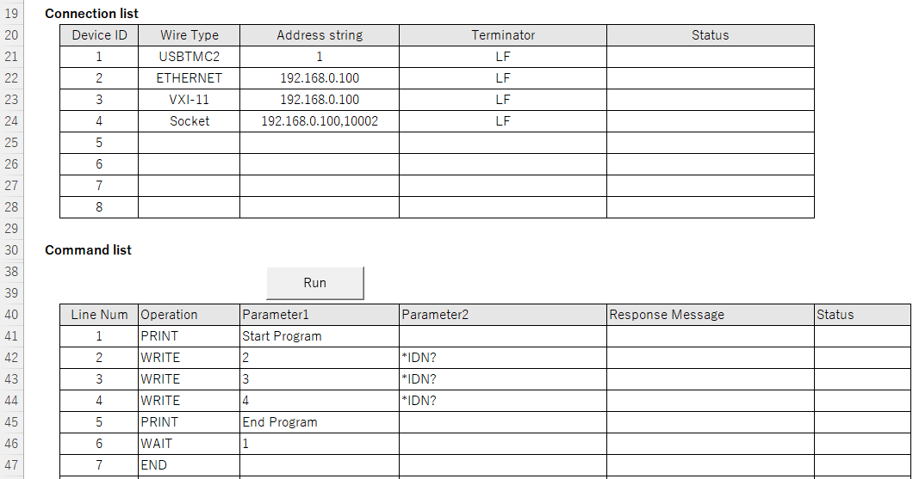

[日本語](README.ja.md) | [English](README.md)

# about Excel Command
Excel Command is an open source software for easy control of measurment instruments. 
Communication commands can be written in an Excel file and sent and received by various communication interfaces. 
It is intended to be used as a jig program to check the communication with the measuring instrument. 
The goal is for the software to be able to quickly generate calibration certificates.

# Features
- Works with Excel VBA (spreadsheet macro language) and TMCTL.DLL. You can run the program right after downloading it.
- Communicates with measuring instruments via GP-IB, RS232, USB, or LAN.
- Controls and measures up to eithgt measurment instruments.
- Japanese and English text can be switched.

# Operating environment
- OS：Windows 2000, XP, Vista, 7, 8, 10, 11
- Excel：2010, 2013, 2016, 2019, 2021
  - Office for Mac and Microsoft 365 are not supported.

# Target devices
- Measurment instruments compliant with IEEE488.2-1987

# Communication interface
- GP-IB: Environment in which National Instruments GP-IB interface works.
  - Install [NI-488.2](https://www.ni.com/ja-jp/support/downloads/drivers/download.ni-488-2.html) separately.
- RS232C: Environment in which serial port or virtual COM port operates.
- LAN: Socket communication, VXI-11, or HiSLIP must work.
- USB: Environment where National Instruments NI-VISA or Yokogawa Measurement USB driver works.
  - Please install [NI-VISA](https://www.ni.com/ja-jp/support/downloads/drivers/download.ni-visa.html) or [Yokogawa USB driver](https://tmi.yokogawa.com/jp/library/documents-downloads/software/usb-drivers/) separately.

## How to use
## Download and Extract
After downloading the ZIP file, extract the 5 file (ExcelCommand.xlsm, tmctl.dll, tmctl64.dll, YKMUSB.dll and YKMUSB64.dll), and place these files in the same directory.

## Open a book containing macros
By default Excel displays a security warning and disables macros when you try to open a book containing macros. To enable macros, follow these steps

- In an Excel program, on the File tab, click Options.
- Click Trust Center, and then click Trust Center Settings. The following screen is an example from
- Click "Macro Settings".
- Select "Enable VBA macros" from the "Macro Settings" list

## Address string

## Instruction

## Example

## Copyright
Excel Commmand: An excel macro file to communicate some measurement insturuments.

Copyright (C) 2023 Takatoshi Yamaoka

Licensed under the Apache License, Version 2.0 (the "License");
you may not use this file except in compliance with the License.
You may obtain a copy of the License at

    http://www.apache.org/licenses/LICENSE-2.0

Unless required by applicable law or agreed to in writing, software
distributed under the License is distributed on an "AS IS" BASIS,
WITHOUT WARRANTIES OR CONDITIONS OF ANY KIND, either express or implied.
See the License for the specific language governing permissions and
limitations under the License.
